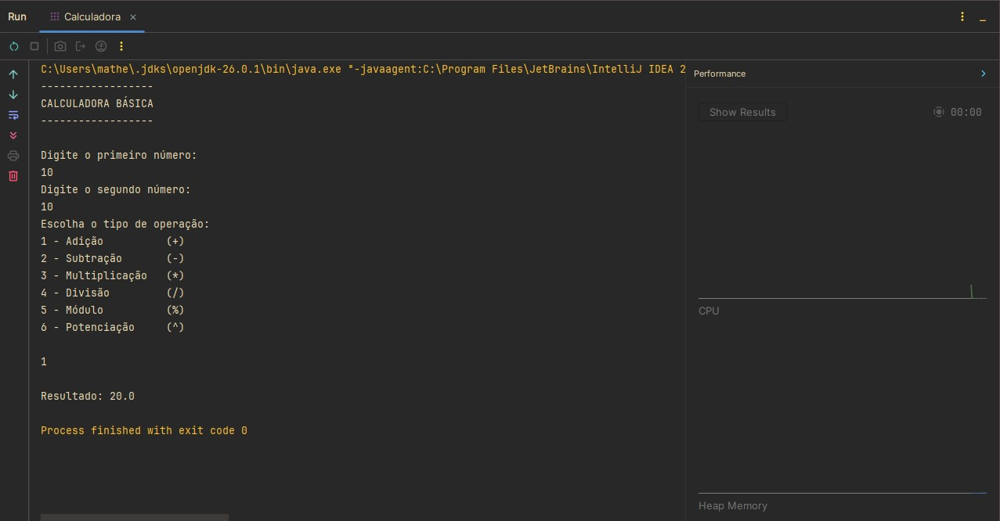

# Calculadora Básica em Java

Projeto desenvolvido durante meus estudos de **Java** com o objetivo de praticar entrada de dados, operadores aritméticos, estruturas condicionais e utilização de métodos da biblioteca padrão da linguagem.

## Sobre este repositório

Este repositório faz parte da minha jornada de aprendizado em Java. Meu objetivo é documentar os principais exercícios e projetos desenvolvidos ao longo dos estudos, registrando minha evolução na linguagem e construindo um portfólio para oportunidades de estágio e desenvolvimento de software.

## Descrição

O programa funciona como uma calculadora de console. Inicialmente, solicita ao usuário dois números do tipo `double` e, em seguida, apresenta um menu com diferentes operações matemáticas.

O usuário pode escolher entre:

* Adição
* Subtração
* Multiplicação
* Divisão
* Módulo (resto da divisão)
* Potenciação

Após selecionar a operação desejada, o programa realiza o cálculo correspondente e exibe o resultado. Caso seja informada uma opção inválida, uma mensagem de erro é apresentada.

## Tecnologias e conceitos utilizados

* IntelliJ IDEA
* Java
* Scanner
* Locale
* Variáveis e tipos primitivos
* Operadores aritméticos
* Operador condicional (`? :`)
* Método `Math.pow()`
* Entrada e saída de dados
* Estruturas condicionais

## Demonstração

<p align="center">
  
</p>

## Estrutura do projeto

```text
DesafioFundamentos/
│
├── images/
│   └── printCalculadora.jpg
│
├── Calculadora.java
│
└── README.md
```

## Objetivo

Praticar conceitos fundamentais da linguagem Java, especialmente:

* leitura de dados utilizando a classe `Scanner`;
* utilização de operadores aritméticos;
* implementação de um menu de opções;
* uso do operador condicional ternário;
* utilização de métodos da classe `Math`;
* entrada e saída de dados no console.

## Aprendizados

Durante o desenvolvimento deste projeto, pratiquei:

* utilização da classe `Scanner`;
* configuração da localidade com `Locale`;
* manipulação de variáveis do tipo `double` e `int`;
* utilização do operador ternário para tomada de decisão;
* aplicação do método `Math.pow()` para cálculos de potência;
* organização básica de um programa em Java;
* boas práticas de entrada e saída de dados.

## Como executar

Clone este repositório:

```bash
git clone https://github.com/SEU-USUARIO/java-calculadora-basica.git
```

Acesse a pasta do projeto:

```bash
cd java-calculadora-basica
```

Compile o programa:

```bash
javac Calculadora.java
```

Execute:

```bash
java Calculadora
```

## Autor

**Matheus Ferreira Lopes**

Estudante de Desenvolvimento de Software Multiplataforma (FATEC Diadema)
